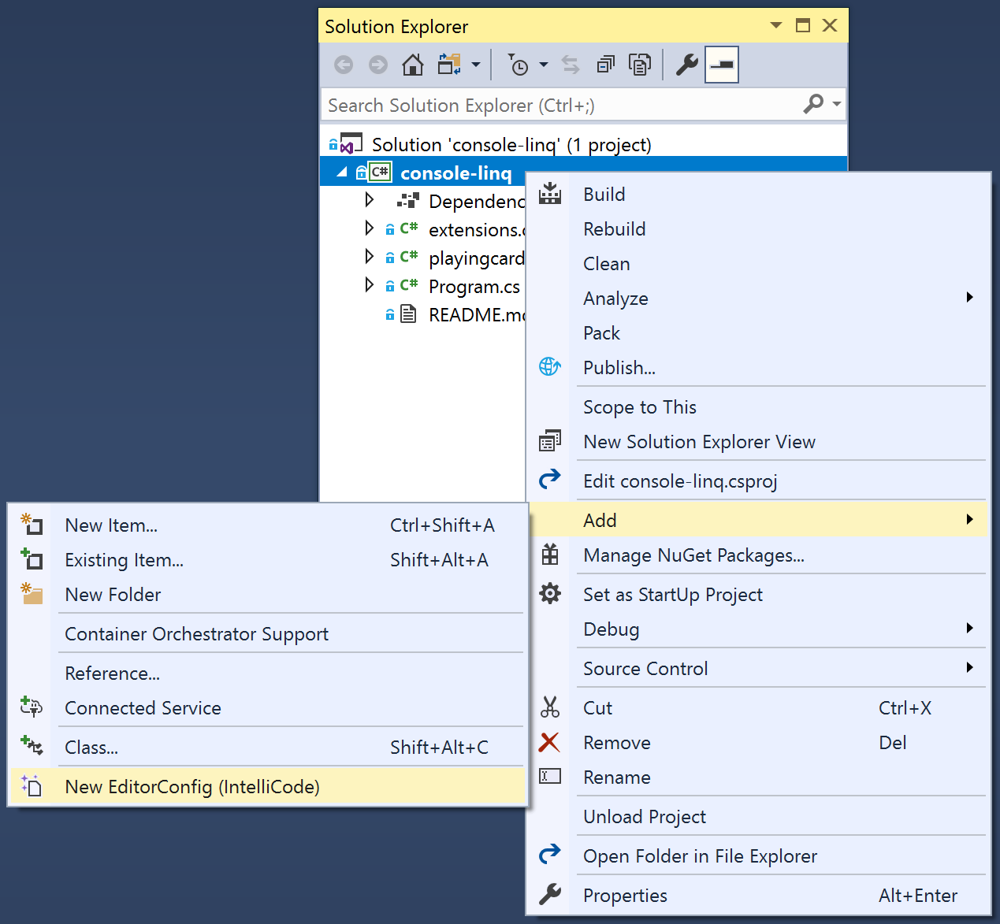

# Generate an EditorConfig file

[EditorConfig files](/visualstudio/ide/create-portable-custom-editor-options) help to keep your code consistent by defining code styles and formats. These conventions allow Visual Studio to offer automatic style and format fixes to clean up your document. For C# developers, IntelliCode can infer your code style and formatting conventions to dynamically create an EditorConfig file.

You can add an IntelliCode-generated EditorConfig file at the project or solution level in Visual Studio (or to a solution folder). To add a prepopulated EditorConfig file, right-click on the desired location in **Solution Explorer** and choose **Add** > **New EditorConfig (IntelliCode)**

   

After you add the file in this way, IntelliCode automatically populates it with code style conventions it infers from your codebase.

> [!NOTE]
> Code style inference is a preview feature and is disabled by default. It can be enabled through **Tools** > **Options** > **IntelliCode**. It is currently available only for C# code. To access this feature be sure to update to the latest Visual Studio 2019 Preview release.

For more information about generating an EditorConfig file based on code styles in your codebase, see [this blog article](https://devblogs.microsoft.com/visualstudio/visual-studio-intellicode-inferring-coding-conventions-for-consistent-code/).

## Apply EditorConfig conventions

Violations of code style conventions in an EditorConfig file don't appear in the **Error List** or as "squiggles" in your code. They can, however, be applied by using the **Code Cleanup** command (Visual Studio 2019) or the **Format Document** command (Visual Studio 2017).

If you're using Visual Studio 2017 and **Format Document** is not fixing your style conventions, you may not be opted in to code style fixes during document formatting. For example, **Apply implicit/explicit type preferences** runs style rules about the use of `var`. Configure which issues are fixed by using the formatting options dialog box. Choose **Tools** > **Options** > **Text Editor** > **C#** > **Code Style** > **Formatting** > **General** > **Format Document Settings (Experiment)**.

## Inferred convention reference

IntelliCode doesn't yet support the full set of conventions documented in [code style settings reference](/visualstudio/ide/editorconfig-code-style-settings-reference). IntelliCode can currently infer the following [formatting](#formatting-conventions) and [style](#style-conventions) conventions:

### Formatting conventions

- csharp_space_between_method_declaration_parameter_list_parentheses
- csharp_space_between_method_declaration_empty_parameter_list_parentheses
- csharp_space_between_method_call_name_and_opening_parenthesis
- csharp_space_between_method_call_parameter_list_parentheses
- csharp_space_between_method_call_empty_parameter_list_parentheses
- csharp_space_after_keywords_in_control_flow_statements
- csharp_space_between_parentheses
- csharp_space_after_cast
- csharp_space_after_colon_in_inheritance_clause
- csharp_space_before_colon_in_inheritance_clause
- csharp_space_around_binary_operators
- csharp_indent_switch_labels
- csharp_indent_case_contents
- csharp_indent_case_contents_when_block
- csharp_indent_labels
- csharp_preserve_single_line_blocks
- csharp_preserve_single_line_statements
- csharp_new_line_before_open_brace
- csharp_new_line_before_else
- csharp_new_line_before_catch
- csharp_new_line_before_finally
- csharp_new_line_before_members_in_object_initializers
- csharp_new_line_before_members_in_anonymous_types
- csharp_new_line_between_query_expression_clauses

### Style conventions

- csharp_new_line_before_catch
- csharp_new_line_before_else
- csharp_new_line_before_members_in_anonymous_types
- csharp_new_line_before_members_in_object_initializers
- csharp_new_line_before_finally_style
- csharp_new_line_between_query_expression_clauses
- csharp_prefer_braces
- csharp_preferred_modifier_order_style
- csharp_prefer_simple_default_expression
- csharp_preserve_single_line_blocks
- csharp_space_after_cast
- csharp_space_after_keywords_in_control_flow_statements
- csharp_space_between_method_call_parameter_list_parentheses
- csharp_space_between_method_declaration_parameter_list_parentheses
- csharp_space_between_parentheses
- csharp_style_expression_bodied_accessors
- csharp_style_expression_bodied_constructors
- csharp_style_expression_bodied_indexers
- csharp_style_expression_bodied_methods
- csharp_style_expression_bodied_operators
- csharp_style_expression_bodied_properties
- csharp_style_inlined_variable_declaration
- csharp_style_pattern_local_over_anonymous_function
- csharp_style_pattern_matching_over_as_with_null_check
- csharp_style_var_for_built_in_types
- csharp_style_var_when_type_is_apparent
- dotnet_sort_system_directives_first
- dotnet_style_explicit_tuple_names
- dotnet_style_object_initializer
- dotnet_style_predefined_type_for_locals_parameters_members
- dotnet_style_predefined_type_for_member_access
- dotnet_style_prefer_inferred_anonymous_type_member_names
- dotnet_style_qualification_for_event
- dotnet_style_qualification_for_field
- dotnet_style_qualification_for_method
- dotnet_style_qualification_for_property
- dotnet_style_require_accessibility_modifiers

## See also

- [IntelliCode for Visual Studio overview](intellicode-visual-studio.md)
