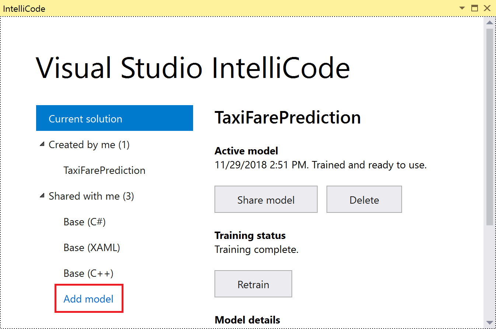
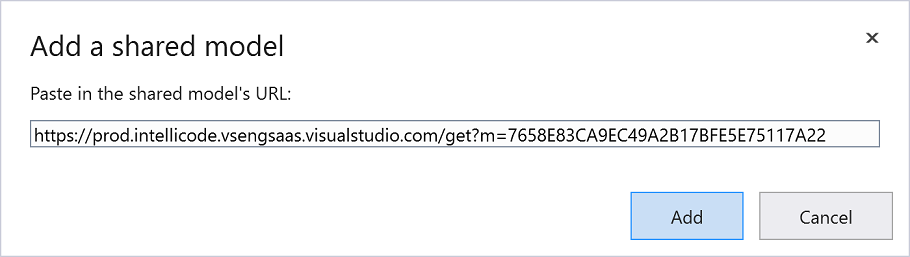

# IntelliCode models based on your code FAQ

IntelliCode’s recommendations have previously been based on patterns learned from thousands of open-source GitHub repos. But what if you’re using code that isn’t in that set of repos? Perhaps you use numerous internal utility and base class libraries, or domain-specific libraries that aren’t commonly used in open-source code, and you'd like to see IntelliCode recommendations for them too. For C# users, IntelliCode can learn patterns from your code to make recommendations for things that aren’t in the open-source domain.

## Q. What is a model and what should I expect from it?

A model is an encapsulation of a set of rules that allow prediction of some useful information (for example, recommendations in the IntelliSense list) based on well-understood inputs.

IntelliCode’s AI-based IntelliSense has always worked on the so-called *base model*. The base model was derived by training on thousands of highly rated, open-source projects on GitHub. Our new service enables the creation of *custom* models, which use the same learning process but are trained on your own code. Using a custom model enables IntelliCode to make recommendations for things found only in your codebase. The more code you provide to illustrate your patterns of usage, the more capable the custom model will be of offering good recommendations.

## Q. How do I train a model?

To train a model, follow these steps:

1. Open a project or solution in Visual Studio.

1. Open the IntelliCode page by choosing **View** > **Other Windows** > **IntelliCode**.

1. Choose **Train on my code**.

   

## Q. What happens when my model is trained, and what data is sent to Microsoft?

To train a model based on your code, the IntelliCode extension extracts only those elements of the code that are needed to create a model for recommending completion values. For example, it extracts the names of classes and methods and how often they're called in different circumstances. The extracted data is transmitted to the IntelliCode service, which uses a machine learning algorithm to extract a model for your code. It then returns the model to your computer where it's merged with the base model.

We don’t track your keystrokes or extract the values of literals (such as strings) from your code, nor do we extract whole expressions or statements. All communication with the IntelliCode service is over HTTPS. For more information, see [Q. How secure is this?](#how-secure).

## Q. Can I see the data that is sent to Microsoft?

If you want to inspect the detailed contents of the extracted data, you can do so after extraction during the training process is complete.

To inspect the contents of the extracted data:

1. Open the %TEMP%\Visual Studio IntelliCode folder.

1. There is one folder per training session in that directory, each with a randomized name. Sort the folder view by date (descending) so that the folder for your most recent training session is at the top. Open it.

1. The folder contains the entire set of files that are sent to Microsoft when extraction is complete. The UsageOutput subfolder contains a JSON file, which has the information we extract from your code to train the model. The UsageOutput_ErrorStats file contains any errors found when trying to build the extracted file, and can help if we need to debug issues.

   

If you want to inspect the extracted data for a different codebase before trying it on your own code, see [Q.Is there a way to try this out without using my own codebase?](#try-sample).

## <a name="try-sample" /> Q. Is there a way to try this out without using my own codebase?

Yes. You can try out the training process on a public or sample codebase first, for example to see the kind of data we collect.

A good sample to start with is the [Windows RSS reader sample](https://github.com/Microsoft/Windows-appsample-rssreader). Clone the repo, open the RssReader.sln solution, build to check that it's working, and then train the model. You should find some good completions on instances of the **MainViewModel** class to try out.

## <a name="how-secure" /> Q. How secure is this? Can others see the models I create?

Your models are private to you and those people that have access to the sharing links you generate via the "share" functionality.

All data you send to and receive from the IntelliCode service is transmitted over HTTPS. You must [sign in to Visual Studio](/visualstudio/ide/signing-in-to-visual-studio) in order to communicate with the service. Models can only be retrieved either by the authenticated user who submitted the extracted data for training, or by someone they authorized by having a sharing link. This means that your model and what is learned about your code stays private to you and your intended collaborators.

Authorized Microsoft service personnel may be granted access to your models and extracted data for troubleshooting and diagnostic purposes only.

We expect that organizations may wish to have ways of sharing models that are unique to their organizational structure, access control models, et cetera. We’re interested to hear more from you about this subject.

## Q. How often should I retrain the model – does it get better over time?

For AI-enhanced IntelliSense recommendations, the model becomes stale if you change method usages and names, add new methods, et cetera. The model doesn't know about those new usages and names until you train it again. If you've made numerous changes or additions to a codebase, consider retraining any models that were created from it.

Retraining is a manual process, so the model won't improve unless you elect to retrain. In the future, we’d like to automate this process. For example, we're considering ways you may be able to include retraining as part of your continuous integration (CI) build steps.

## Q. Are there limits to the amount of training I can or should do?

There is no benefit to retraining your model unless you’ve made significant code changes and are looking to see those changes reflected in your recommendations from IntelliCode.
In our current experimental preview release, we're not limiting training by default, but may do so if it's necessary to maintain acceptable service performance. Future versions of the service may impose limits to the amount of retraining you can perform.

## Q. Can I train on a folder of code without opening a solution?

No, this is not currently supported. You must open a solution in Visual Studio in order to train a model.

## Q. How much does this service cost? Is there a free tier?

IntelliCode will always have a substantive free tier. During the free preview, we're evaluating capabilities that we may charge for after we exit preview.

## Q. What else is coming? What's the roadmap? What can I expect?

We're actively working to expand IntelliCode’s AI-assisted development capabilities. We're excited to share them publicly as they become available. You can sign up for news and updates at [https://aka.ms/intellicode](https://aka.ms/intellicode) to be the first to know!

## Q. What languages and tools are supported?

Currently, only C# users in Visual Studio 2017 version 15.7 and higher can take advantage of training models on their own code in the experimental preview. We'll track feedback on the experience of C# and refine the training service as we proceed.

Other languages and tools are currently supported with models pre-trained on a large number of open-source codebases. These languages are:

**Visual Studio**: C#, C++, and XAML

**Visual Studio Code**: Java, JavaScript, Python, and TypeScript

## Q. Can I opt out and have my models removed?

You can remove models from your account so they can no longer be used. Choose the **Delete** button on the IntelliCode training page in Visual Studio.

## Q. Is there a restriction on the size of the model, or sizes and numbers of models I can train?

In our current experimental preview release, we don't limit training. In the future, we may impose training limits if we can't maintain acceptable service performance.

## Q. What size codebase is ideal for training a model?

To get useful predictions, a codebase should represent the common usage patterns for the APIs, objects, and methods that you use. The larger the variety of common usages that a codebase illustrates, the more useful the resulting model is in predicting those usages.

Training your own model is useful for those cases where your frequently used classes are either private to your codebases or aren't common in the open-source codebases we train with. All IntelliCode users get the benefit of the "base model" that's trained on thousands of public repos, for commonly used classes. Unless you have unusual usage patterns on those common classes, you won’t need to train on your own code to see good recommendations for them.

## Q. How do I use a sharing link to see a model that someone else shared with me?

You can do this on the IntelliCode page in Visual Studio, after you install the Visual Studio IntelliCode extension.

1. Open the IntelliCode page by choosing **View** > **Other Windows** > **IntelliCode**.

1. On the IntelliCode page, choose **Add model**. It's underneath **Shared With Me** in the left-hand navigation.

   

1. Paste the sharing link URL into the dialog box and choose **Add**.

   

   The shared model appears under **Shared With Me**. If you want to unlink the model, choose **Unlink**.

## Q. How many people in my team can I share the model I create with?

You can share your model with as many people as you like via the sharing feature. Team members can't retrain the model, but do see the same completion recommendations as you do.

## See also

- [General IntelliCode FAQ](faq.md)
- [IntelliCode extension for Visual Studio](intellicode-visual-studio.md)
- [IntelliCode extension for Visual Studio Code](intellicode-visual-studio-code.md)
