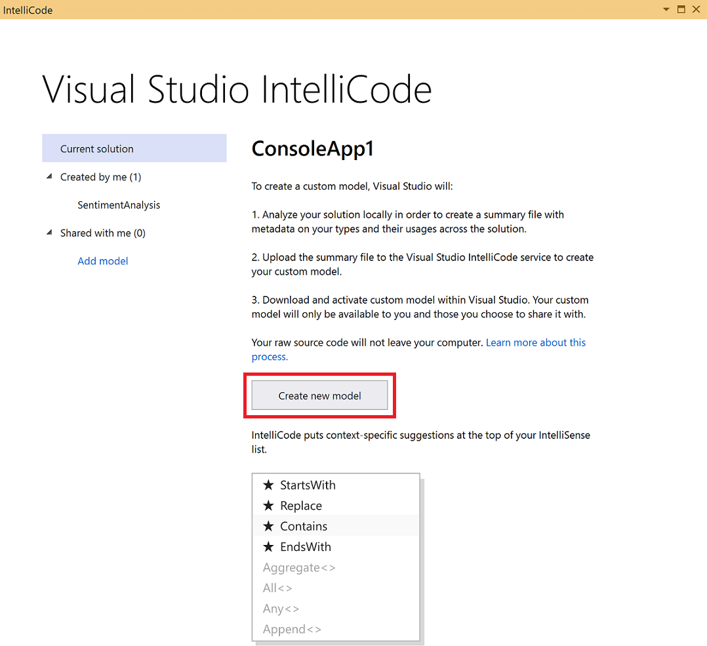

# IntelliCode team completions: AI-assisted IntelliSense based on your code

Use IntelliCode team models for completions to get AI-assisted IntelliSense recommendations based on *your* C# codebase. Team completions are useful if you use internal utility and base class libraries or domain-specific libraries that aren’t commonly used in open-source code. This is because IntelliCode’s *base model* recommendations are based solely on patterns learned from open-source GitHub repos. If you’re using code that isn’t in that set of repos, those recommendations aren't as useful to you. For C# users, IntelliCode can learn patterns from your code to make recommendations for things that aren’t in the open-source domain.

An IntelliCode model is an encapsulation of a set of rules that allow prediction of some useful information (for example, recommendations in the IntelliSense list) based on well-understood inputs. IntelliCode creates *custom* models for your team using the same learning process as for the IntelliCode base models, except they are trained on your own code. The more code you provide to illustrate your patterns of usage, the more capable the custom model will be of offering good recommendations.

> [!NOTE]
> Team completions is a preview feature and is disabled by default. It can be enabled through **Tools** > **Options** > **IntelliCode**. It is currently available only for C# code.

## How models get applied

IntelliCode generates its recommendations from multiple models by merging together:

- The base model for the language you're using (which is trained on thousands of public GitHub repos)
- Any team models you've trained
- Any team models you've added to your profile from sharing links that others gave you; you add a team model by clicking the **Add model** link in the Visual Studio IntelliCode UI

You don't need to manage which models apply to which solution or codebase because IntelliCode takes care of this for you.

## Create a model

To get useful predictions, a codebase should represent the common usage patterns for the APIs, objects, and methods that you use. The larger the variety of common usages that a codebase illustrates, the more useful the resulting model is in predicting those usages.

To train a model, follow these steps:

1. Open the project or solution in Visual Studio.

1. Open the IntelliCode page by choosing **View** > **Other Windows** > **IntelliCode Model Management**.

1. Choose **Create new model**.

   

> [!NOTE]
> You must open a solution in Visual Studio in order to train a model. You can't train on just a folder of code.

### Automatically create and retrain a model 

You can automatically create and retrain a model as part of your continuous integration (CI) pipeline in [Azure Pipelines](/azure/devops/pipelines/get-started/what-is-azure-pipelines?view=azure-devops). When code changes are pushed to your repository and the build task runs, the team model for completions is retrained and then made available to everyone that you've shared the model with. Visual Studio periodically checks for updates to custom models and will download updates to your team model automatically.

To set up team model creation and retraining in Azure Pipelines:

1. Before you start, make sure that:

   - You have permission to create and edit pipelines for the project.
   - The build agent has Visual Studio 2017 or later installed.
   - You have enabled acquisiton of team models. You can verify this setting in **Tools** > **Options** > **IntelliCode** > **Acquire team models for completions**.

2. Add a task to your pipeline to download any NuGet packages that are required by the codebase.

3. Download the [Visual Studio IntelliCode Build task](https://marketplace.visualstudio.com/items?itemName=VisualStudioExptTeam.VSIntelliCodeBuild) from Visual Studio Marketplace to your Azure DevOps organization or Azure DevOps Server (formerly TFS). This task scans your source code and extracts the data it needs to create an IntelliCode model. The extracted data is uploaded to the IntelliCode service, which creates the model and associates it with your account.

4. Add the IntelliCode Build task to your pipeline. Place it after the compilation task.

TODO: Add screenshot when we have final build for screenshots :) 

5. In the task configuration pane, select the branch that you want to train the model on. We recommend using a relaase or any other persistent branch.

6. In the classic editor, under **IntelliCode connection**, select **New** to create a new OAuth 2.0 connection to the IntelliCode service. This connection is used to upload the training data to create the model. Use the same account that you use to sign in to Visual Studio, so you can see the model in Visual Studio.
   - If you're using the yaml editor, you must first create a connection in **Project Settings** > **Pipelines** > **Service Connection** and then select it from the **IntelliCode Connection** dropdown in the task configuration pane.

TODO: Add picture of configuration pane for classic and yaml editor.

7. Open the corresponding repository to your pipeline in Visual Studioto to automatically download the created team model via the [repo-attached model](#repo-attached-team-models-for-completions) feature.
8. Your model will be automatically updated with each CI build and 

### Train on a public codebase

Before you train on your own code, you might want to create a custom model on a public codebase. You can see how the custom model affects IntelliSense, or if you're concerned about the kind of data that IntelliSense collects, you can inspect the extracted data. Some interesting samples to train on are:

- [Azure ConferenceBuddy](https://github.com/Azure/ConferenceBuddy)

   Clone the repo, open the *ConferenceBuddy.sln* solution, build to check that it's working, and then train the model. You'll find some good completions on instances of the **AskWhoTask** class.

- [Windows RSS reader](https://github.com/Microsoft/Windows-appsample-rssreader)

   Clone the repo, open the *RssReader.sln* solution, build to check that it's working, and then train the model. You'll find some good completions on instances of the **MainViewModel** class.

## Data and privacy

To train a model based on your code, IntelliCode extracts only those elements of the code that are needed to create a model for recommending completion values. For example, it extracts the names of classes and methods and how often they're called in different circumstances. IntelliCode doesn't track your keystrokes or extract whole expressions, statements, or literal values (such as strings) from your code.

The extracted data is transmitted, over HTTPS, to the IntelliCode service. The service then uses machine learning algorithms to train a model for your code. It returns the model to your computer where it's merged with the base model.

### View extracted data

To inspect the contents of the extracted data:

1. Open the *%TEMP%\Visual Studio IntelliCode* directory.

1. To find and open the training for your most recent training session, sort the folder view by date (descending). The folder for your most recent training session is now at the top.

   > [!TIP]
   > There's one folder per training session in the *%TEMP%\Visual Studio IntelliCode* directory, each with a randomized name.

The folder contains the entire set of files that are sent to Microsoft when extraction is complete. The *UsageOutput* subfolder contains a JSON file that has the information IntelliCode extracts from your code to train the model. The *UsageOutput_ErrorStats* file contains any errors found when trying to build the extracted file and can help if Microsoft needs to debug issues.

If you want to inspect the extracted data for a different codebase before trying it on your own code, train a model on a public codebase.

### How we secure your data

Your models are private to you and those people that have the sharing links that you generate by choosing **Share model**.

All data you send to and receive from the IntelliCode service is transmitted over HTTPS. You must [sign in to Visual Studio](/visualstudio/ide/signing-in-to-visual-studio) in order to communicate with the service. Models can only be retrieved either by the authenticated user who submitted the extracted data for training or by someone they authorized by sharing the link to the model. This means that your model and what is learned about your code stays private to you and your intended collaborators.

If Microsoft needs to troubleshoot, authorized Microsoft service personnel may be granted access to your models and extracted data for diagnostic purposes only.

## Share a custom model

### Manual sharing
After you've trained a model, the **Share model** button appears. Click the button to copy the sharing link. From there, you can share the link with your collaborators.

 > [!NOTE]
 > Anyone who has the sharing link can access the model and its suggestions, so make sure that everyone who receives the link is aware of this.

You can share your model with as many people as you like via the sharing feature. Team members can't retrain the model but they do see the same completion recommendations as you do.

For more information about sharing models, see [How to: Share custom models](share-models.md).

### Repo-attached team models for completions

TODO: Info on repo attached

## Retrain a model

For AI-assisted IntelliSense recommendations, the model becomes stale if you make changes such as renaming a method or adding new methods. The model doesn't know about those changes until you train it again. If you've made numerous changes or additions to a codebase, consider retraining any models that were created from it.

You can retrain your model manually or [automatically](#automatically-create-and-retrain-a-model) as part of a continuous integration (CI) pipeline.

There's no benefit to retraining your model unless you’ve made significant code changes and would like to see those changes reflected in IntelliCode's recommendations.

## Delete a model

You can remove models from your account so they can no longer be used. To do this, choose the **Delete** button on the IntelliCode training page in Visual Studio.

To delete a model created from the Azure DevOps task:
1. Delete the Azure DevOps build task for creating team models for completions from your pipeline.
2. Sign into Visual Studio with the same account associated with 

To completely remove your data from the training service, send a request to [vsintellicodedata@microsoft.com](mailto:vsintellicodedata@microsoft.com) from the personalization account you're using.

## See also

- [Share models](share-models.md)
- [Overview of IntelliCode](overview.md)
- [General IntelliCode FAQ](faq.md)
- [IntelliCode for Visual Studio](intellicode-visual-studio.md)
