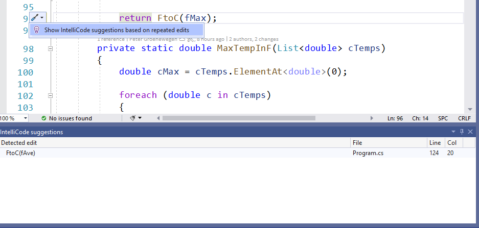

# IntelliCode suggestions 
IntelliCode suggestions assists you when making similar edits in multiple places in your code. It tracks your edits locally, and detects repetition. It then offers to apply those same edits in other places where they might apply. For example, if you have missed locations where a refactoring could be applied, IntelliCode suggestions helps you find those locations and fix them.

IntelliCode is aware of the semantic structure of your code. That structure is used to detect situations where changes can be applied, even if variable names are different.

Suppose you are replacing a repeated temperature conversion with a helper function. IntelliCode will detect the repeated change you are making, and suggest you make that change in other places.

Suggestions appear as [Quick Actions](/visualstudio/ide/quick-actions) in Visual Studio editor. IntelliCode suggestions have the Quick Action menu options **Apply suggestion** and **Ignore suggestions like this**. If you want to use the suggested change, select **Apply suggestion**. 

If you don’t want to use the suggested change, select the **Ignore suggestions like this** action. IntelliCode won’t bother you about that pattern again unless you recreate it.

If you want to see the list of all suggested changes, go to **View** > **Other windows** > **IntelliCode suggestions**. 

## Preview features

You may see a lightbulb when IntelliCode detects a repeated edit. The lightbulb has an action which will show you a list of the suggestions found. This opens the IntelliCode suggestions window, so you can locate and act on the suggestions. 

You can configure this lightbulb at **Tools** > **Options** > **IntelliCode General** tab, and enable/disable "Show lightbulb when new suggestion is discovered". 

## Disable IntelliCode suggestions
Suggestions is turned on by default for Visual Studio version 16.7 and above. 

If you wish to turn it off, choose **Tools** > **Options**, **IntelliCode General** tab, and then switch **C# suggestions** to **Disabled**:
