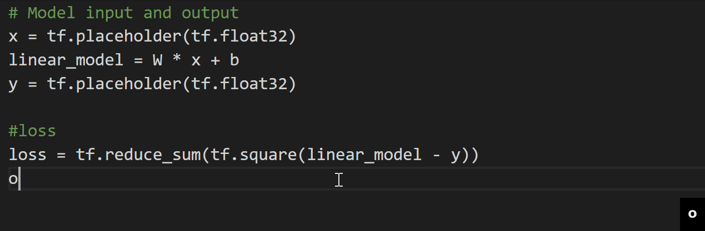
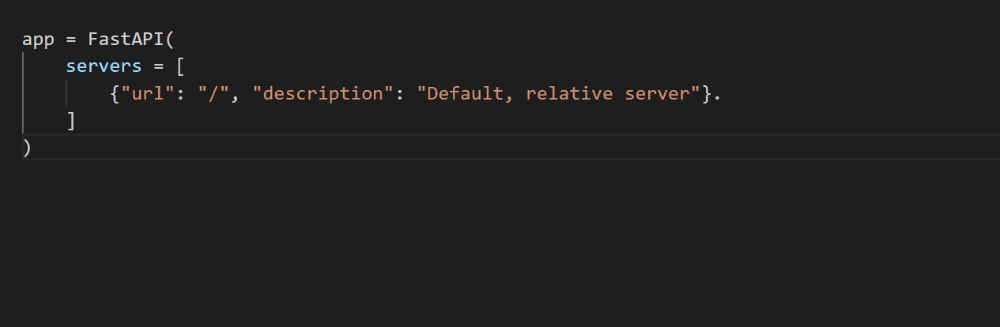

# IntelliCode Completions Preview for Visual Studio Code

The [IntelliCode Completions extension for Visual Studio Code](https://marketplace.visualstudio.com/items?itemName=VisualStudioExptTeam.vscodeintellicode-completions) is an experimental extension which predicts up to a whole line of code based on your current code context.

This extension may contain unstable, experimental code. The IntelliCode team is focused on iterating rapidly and new functionality will be added.

## How to use

Completions will appear after your cursor as you type, with a faded color. When the IntelliSense list is open, its selection is used to inform the whole-line autocompletion.

At any time you can accept the suggestion by pressing the tab key (you will need to press it twice if the IntelliSense list is visible). If you don't want to accept the suggestion, you can just keep on typing or press ESC.

### Snippet Completion

If the whole-line autocompletion includes empty strings:

1. The cursor will automatically move to the first empty string upon accepting the prediction with the TAB key.
2. If further empty strings exist within the prediction, pressing the TAB key again will automatically move the cursor to the next empty string.

### Enabling JavaScript/TypeScript Support

To enable experimental support for JavaScript and TypeScript, search for `intellicodeCompletions.language` in the Settings menu.

## Installation

The extension can be aquired at the following link: [IntelliCode Completions extension for VS Code](https://marketplace.visualstudio.com/items?itemName=VisualStudioExptTeam.vscodeintellicode-completions)

The extension is supported by Visual Studio Code November 2021 Release 1.63 or later.

## Provide feedback

If you encounter a problem, you can browse [existing issues](https://github.com/MicrosoftDocs/intellicode/issues) and upvote them using a 👍 "thumbs up" reaction. If you don't see your particular problem, we'd love to hear from you. Include any **Output** window log entries from Visual Studio IntelliCode, Python, Java, JavaScript, or TypeScript with the bug.

## See also

- [IntelliCode for Visual Studio](intellicode-visual-studio.md)
- [IntelliCode general FAQ](faq.yml)

