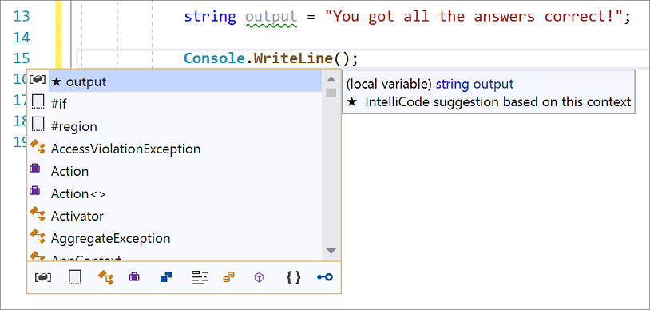
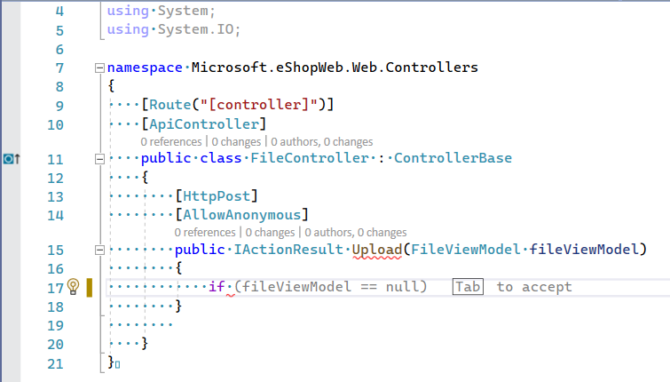

# AI-assisted code development in Visual Studio (IntelliCode)

Visual Studio IntelliCode enhances software development using artificial intelligence, for instance by delivering [context-aware code completions](#context-aware-code-completions), including whole-line completions in gray text. IntelliCode is included by default in most Visual Studio workloads and is available through the Visual Studio installer. This feature predicts the most likely correct method or property for the developer to use instead of just an alphabetical list. It uses the developer's current code context and patterns to provide this dynamic list.

For C# developers, IntelliCode can learn patterns from your code. 
- This means IntelliCode can make recommendations on code that isn’t in the open-source domain, for example, methods in your own utility classes or domain-specific library calls. For more information, see [IntelliCode models based on your code FAQ](custom-models.md).

- In addition to providing member suggestions, IntelliCode also provides *argument completion*. This capability stars the most likely argument names that you'll use when you call a method and places those suggestions at the top of the completion list. The completion list appears when you start typing inside the parentheses or press **Ctrl**+**Space**.
  

- IntelliCode locally tracks your edits, detects when you're performing a repetitive action, and offers [suggestions](intellicode-suggestions.md) to apply that same action in other, similar places (C# only).
  

## Context-aware code autocompletions

IntelliCode provides AI-assisted IntelliSense for multiple languages. IntelliCode suggestions appear at the top of the completion list with a star icon next to them:

The completion list suggests the most likely correct API for a developer to use rather than presenting a simple alphabetical list of members. To provide this dynamic list, IntelliCode uses the developer's current code context and patterns based on thousands of highly rated, open-source projects on GitHub. The results form a model that predicts the most likely and most relevant API calls.

C# developers in Visual Studio 2022 and higher also benefit from [whole-line autocompletions](visual-studio-whole-line-completions.md), which predict the next chunk of your code based on your current code so far, and present it as an inline prediction. 

> [!Note]
> Some of IntelliCode's features are still in preview, meaning there's no guarantee of future support. Preview features are disabled by default. To enable or disable IntelliCode preview features, choose **Tools** > **Options** > **IntelliCode**. Under **Preview Features**, choose **Enable**, **Disable**, or **Default** to configure each feature.

## Install IntelliCode for Visual Studio

1. [Download Visual Studio](https://visualstudio.microsoft.com/downloads/?utm_medium=microsoft&utm_source=learn.microsoft.com&utm_campaign=inline+link&utm_content=download+vs2019) version 16.4 or later.
2. Install a [supported workload](#supported-languages--workloads), such as .NET desktop development. 
   Visual Studio IntelliCode is installed by default.

To turn starred IntelliSense recommendations off, disable the extension by choosing **Extensions** > **Manage Extensions** from the menu, find and select the IntelliCode extension, and then click **Disable**.

## Supported languages & workloads

The **supported languages** for AI-assisted IntelliSense completions are:
- C#
- XAML
- C++
- JavaScript and TypeScript, which require TypeScript 3.4.2 or later
- Visual Basic

IntelliCode is included in Visual Studio 2019 version 16.4 as part of any of the **following workloads**:

- Azure development
- .NET desktop development
- Mobile development with .NET
- Game development with Unity
- .NET Core cross-platform development
- ASP.NET and web development
- Visual Studio extension development
- Universal Windows Platform development
- Office/SharePoint development
- Desktop development with C++
- Game development with C++
- Mobile development with C++
- Linux development with C++
  
## Team completions

Previous versions of IntelliCode provided a way to train a model on your code, providing sorted method completions for team-specific API frameworks, libraries, and other user projects. This functionality has been replaced with a deep learning model that runs on your machine and is freely available for C# users. See [Upgrading from IntelliCode custom team completions models to deep learning](https://devblogs.microsoft.com/visualstudio/upgrading-from-intellicode-custom-team-completions-models-to-deep-learning/). IntelliCode is free for all Visual Studio users.

If you're a C++ user, you can subscribe to [GitHub Copilot](https://github.com/features/copilot) for AI-assisted code development. GitHub Copilot and Visual Studio IntelliSense work together to improve code completions; see [Visual Studio’s IntelliSense list can now steer GitHub Copilot code completions](https://devblogs.microsoft.com/visualstudio/github-copilot-visual-studio-intellisense/). GitHub Copilot requires a subscription, but you can evaluate it with a free trial.

## Troubleshoot IntelliCode errors in Visual Studio 

If you don't see any IntelliCode suggestions, you may have extensions installed that are overriding the IntelliSense UI. Such extensions can prevent the IntelliCode "starred" suggestions from appearing at the top of the list. You can verify if an extension is causing this behavior by turning them off, and then trying IntelliSense again. Or, if the extension supports it, turn off its auto-completion features.

If disabling extensions that override IntelliSense UI doesn't solve the problem for you, report it by using the Visual Studio [Report a Problem](/visualstudio/ide/how-to-report-a-problem-with-visual-studio) feature, and mention IntelliCode in your report.

### **Exception IntelliCode cannot locate git.exe for acquiring model for Team Completions**
   The IntelliCode Team Completions GitHub Action and Azure DevOps Build Task have a dependency on Git source control to get and use repo-attached models for Team Completions. Head to https://git-scm.com/downloads to install Git if you'd wish to use repo-attached models for Team Completions. 
          
###  **Error training model for Team Completions in Azure DevOps task**
   The [Visual Studio IntelliCode Team Model Training](https://marketplace.visualstudio.com/items?itemName=VisualStudioExptTeam.VSIntelliCodeTeamModelTraining) Azure DevOps Task is triggered _only_ when you run a build or release caused by one of the following reasons: `Manual`, `IndividualCI`, `BatchedCI`, `Schedule`, `Scheduled`, and `ContinuousIntegration`. For more information on build and release pipeline triggering reasons see:        
    - `Build.Reason` in [Build variables](/azure/devops/pipelines/build/variables?view=azure-devops&preserve-view=true&tabs=yaml#build-variables).
    - `Release.Reason` in [Release variables](/azure/devops/pipelines/release/variables?view=azure-devops&preserve-view=true&tabs=batch#release-variables)
   In particular, team model for completion training will not work on pull requests. This is by design in order to avoid creating team models for completions that use temporary commits that may get squashed once the pull request is completed, given that users would be unable to consume such models. For more information see [Q. Error consuming or training team model due to unknown commit](#error-consuming-or-training-team-model-due-to-unknown-commit).
          
### **Error training model for Team completions due to model ownership**.
   Team models can only be trained and re-trained by the owner of the model. The owner can also delete the model from IntelliCode's services, see [Delete your model](custom-models.md#delete-your-model).

### **Error training model for Team Completions due to throttling**
   Team models can only be trained once per minute for each repository. Typically that is enough to keep a team model for completions freshly updated with the latest version of your code. 
          
### **Error consuming or training team model due to unknown commit**
   When a team model is trained on a commit, and then that commit is deleted from the git history, or the commit is not accessible to the training machine for another reason, then you'll not be able to consume the model associated to that commit. You may also be unable to train new models going forward if that's the case. If your model is unable to be re-trained due to changes in the git history, try deleting the model and then do another team model training. See [Delete your model](custom-models.md#delete-your-model).

## Telemetry

IntelliCode captures some anonymized usage and error-reporting data to help improve the product. No user-defined code is sent to Microsoft, but we do collect information about your use of the IntelliCode results.  For base model suggestions, which are open source or .NET types and members, we capture whether you selected an IntelliCode suggestion and log the name of the suggestion. Microsoft uses the data to monitor the quality of the base model. For custom models, we capture whether you selected an IntelliCode suggestion but *don't* log the names of your user-defined types or methods.

To turn off data collection for IntelliCode, opt out of the [Visual Studio Experience Improvement Program](/visualstudio/ide/visual-studio-experience-improvement-program). From the menu bar, select **Help** > **Send Feedback** > **Settings**. In the **Visual Studio Experience Improvement Program** dialog, select **No, I would not like to participate** and then select **OK**.

To create models that learn patterns from your own C# code, you need to [sign in to Visual Studio](/visualstudio/ide/signing-in-to-visual-studio) to be able to use the model training service. The training service collects only the minimum data that's required to create the model. Microsoft keeps the trained models secured to your account so only you and people you choose to share them with can access them. Your model and what it’s learned about your code stays private to you. For more information, see [Data and privacy](custom-models.md#data-and-privacy).

## See also

- [Custom models based on your code](custom-models.md)
- [IntelliCode extension for Visual Studio Code](intellicode-visual-studio-code.md)
