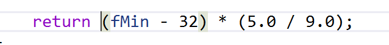
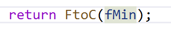
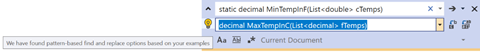
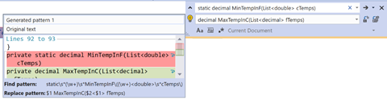

#How to find and replace using patterns (“by example”)

Find and replace can be used to do some refactoring operations but except in the simplest cases, these require creating complex regular expressions.  

Find and Replace by example is a new Visual Studio feature that can let you match more complex patterns without having to create a regular expression yourself – it does it for you.

All you need to do is provide an example of the desired state before and after, right in the find and replace boxes.  Visual Studio will then recommend a set of pattern matches so you can choose the right one and apply it in the usual way.

>[!NOTE] 
>TRY IT NOW: 
>You can try out the example below right away, by cloning [this repo](https://github.com/markw-t/NewFtoC) and opening Program.cs

For example, suppose you wish to replace all instances of methods in a file that have a signature like this:

With a signature like this (changing doubles for decimals)

There are multiple method names to replace.

All you need to do to accomplish this is simply provide the examples above in the find and replace boxes

On doing so, the lightbulb icon appears next to the replace box and lets you know that Visual Studio has found pattern based find/replace options for your case. 
1.	Click the lightbulb to reveal the possible patterns Visual Studio has detected for you
2.	Pick one from the list of possible patterns – you can preview the effect of each pattern by selecting it in the list

3.	Select by pressing enter or clicking - your chosen match will now be used in the Regular Expression find/replace and you can navigate/act as usual for find/replace to change instances in your document and beyond.
