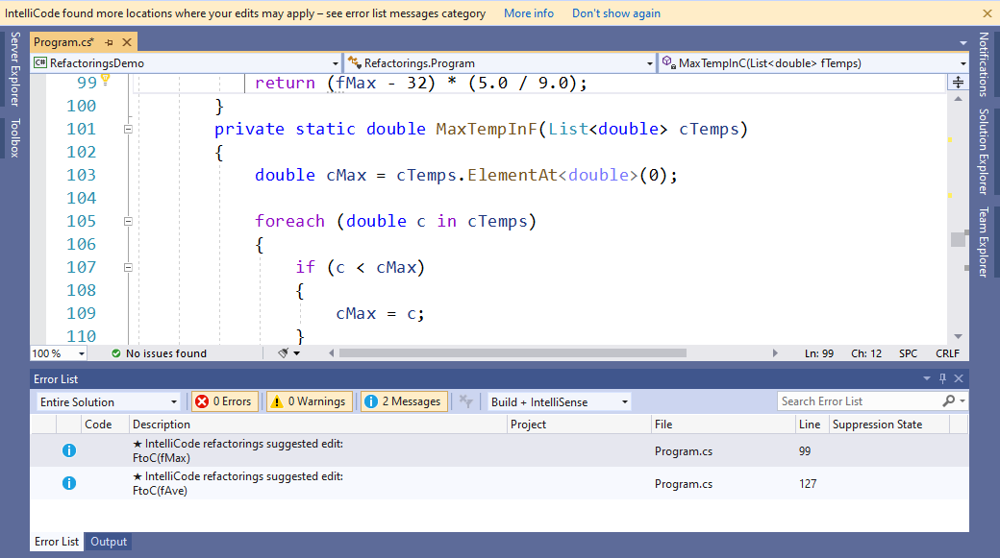

# Refactorings - Suggestion Level (preview)
IntelliCode improves your editing experience when you're making similar edits in multiple places in your code. It locally tracks your edits, detects when you're performing a repetitive action, and offers to apply that same action in other places where you may want it. For example, if you're making a refactoring and have missed locations where it could be applied, IntelliCode helps you find those locations and fix them.

The first time we find a suggestion of this sort, you will see a prompt at the top of your editor letting you know about it. You can opt not to see this prompt again by clicking "Don't show again".

As shown in the screenshot, opportunities to apply refactorings appear as a [Quick Action light bulb](/visualstudio/ide/quick-actions) in the Visual Studio editor, along with grey-dotted [suggestion-level squiggles](/visualstudio/get-started/csharp/visual-studio-ide#popular-productivity-features) and message level entries in the [Error List](/visualstudio/ide/reference/error-list-window). By default, Visual Studio filters out messages in the error list, so you'll need to click on the blue Messages icon in the toolbar at the top of the error list to see them. When you see a lightbulb on a line of code with a suggestion, click on it to display a menu from which you can apply the suggested change.

## Changes IntelliCode can detect
IntelliCode is aware of the semantic structure of your code. It detects situations where the variable names in your changes are different but the essential structure of the change is the same:

If you don’t like a suggested change, select the **Ignore** option on the light bulb, and IntelliCode won’t bother you about that pattern again unless you recreate it. 

## Enable refactorings
Refactorings is a preview feature, so it is turned off by default. 
To turn it on, choose **Tools** > **Options**, **IntelliCode General** tab, **Preview features** area, and then switch **C# refactorings** to **Enabled**:

After you change this setting, close any open files, and then restart Visual Studio.
