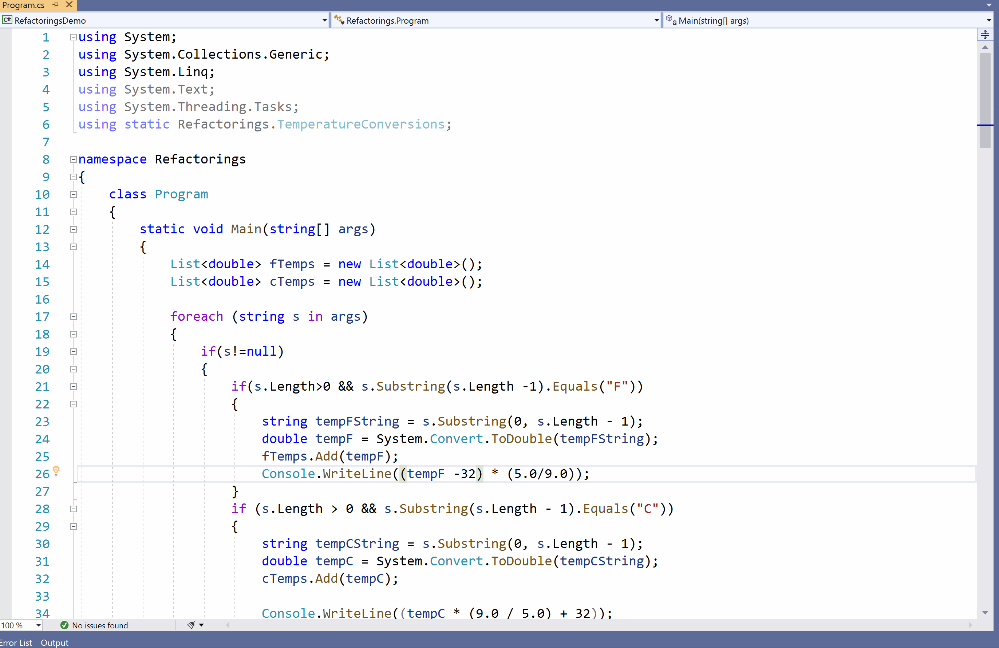
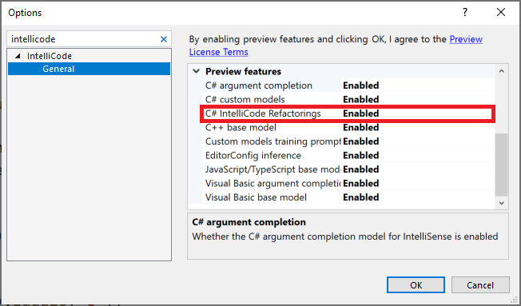

# Refactorings (preview)

IntelliCode improves your editing experience when you're making similar edits in multiple places in your code. It locally tracks your edits, detects when you're performing a repetitive action, and offers to apply that same action in other places where you may want it. For example, if you're making a refactoring and have missed locations where it could be applied, IntelliCode helps you find those locations and fix them.

   

As shown in the video, opportunities to apply refactorings appear as a [light bulb](/visualstudio/ide/quick-actions) in the Visual Studio editor, along with green [warning-level squiggles](/visualstudio/get-started/csharp/visual-studio-ide#popular-productivity-features) and warnings in the [Error List](/visualstudio/ide/reference/error-list-window). The [code cleanup indicator](/visualstudio/ide/find-and-fix-code-errors?#run-code-cleanup) also shows any opportunities found in the current file. Click on the light bulb to display a menu from which you can apply the change to the detected location.

IntelliCode is aware of the semantic structure of your code. It detects situations where the variable names in your changes are different but the essential structure of the change is the same:

   

If you don’t like a suggested change, select the **Ignore** option on the light bulb, and IntelliCode won’t bother you about that pattern again unless you recreate it. 

## Enable refactorings
Refactorings is a preview feature, so it is turned off by default. 
To turn it on, choose **Tools** > **Options**, **IntelliCode General** tab, **Preview features** area, and then switch **C# refactorings** to **Enabled**:

  

After you change this setting, close any open files, and then restart Visual Studio.
