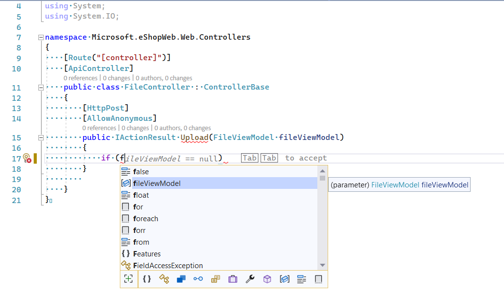
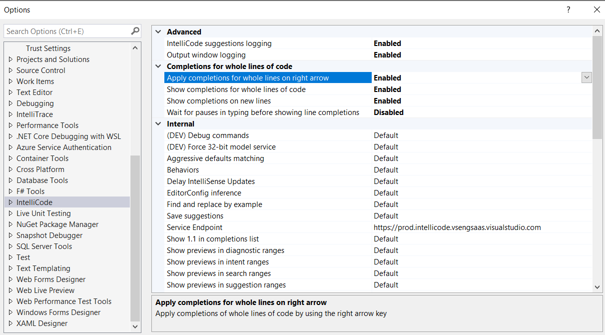
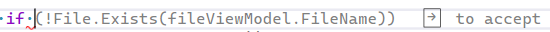
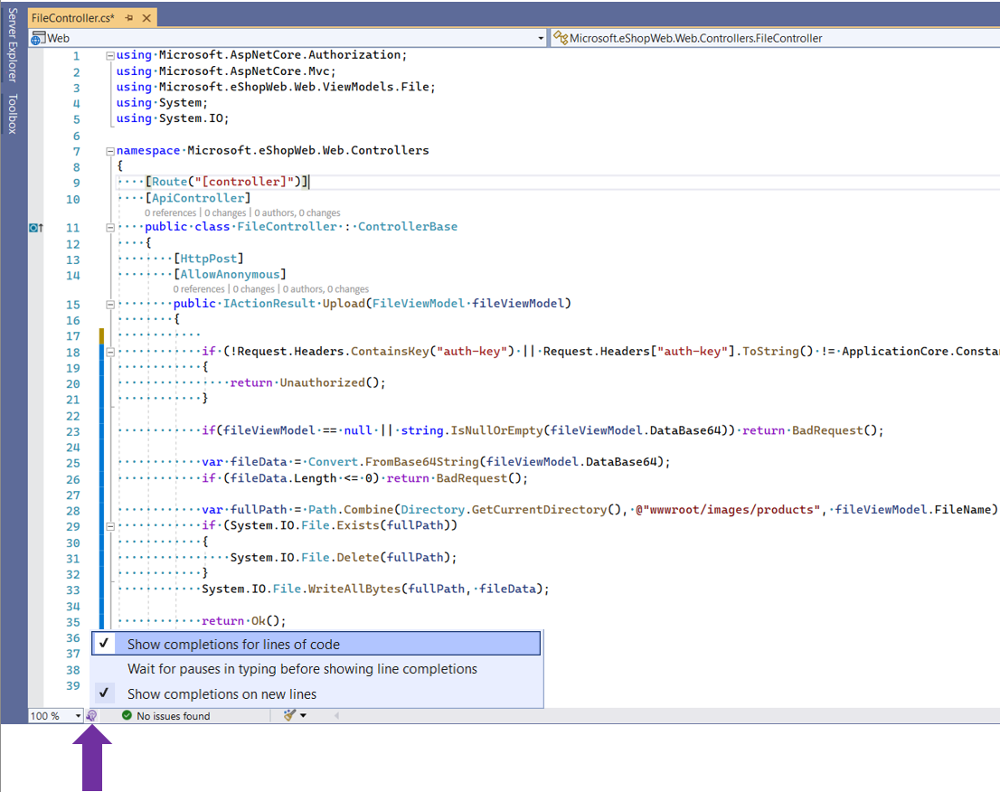

# Visual Studio IntelliCode Whole line completions

IntelliCode whole line completions predicts the next chunk of your code based on your current code so far, and presents it as a gray text inline prediction. Think gray text autocompletion that you see when typing emails but for code. This feature is available in Visual Studio 2022. 

## How it works

IntelliCode uses a large scale transformer model, trained on around half a million public, open-source repos from GitHub. This model makes predictions on what you type next based on a rich knowledge of what you have coded so far, including:
- Variable names and positions
- Libraries you're using
- Functions in nearby code
- The IntelliSense list

The model runs on your local machine, which enables the feature to be available in offline and air gapped environments. The feature supports many programming languages including Python, JavaScript, TypeScript, C#, and Visual Basic.  

## Two Modes

IntelliCode provides completions in two ways - one, when the user is typing and two, when the user has an item selected in the IntelliSense list. 

### Mode 1: Whole line completions when typing
When the user is typing, we show whole line completions that can be accepted by "Tab to accept". To dismiss the prediction, you can use the `Esc` or `Delete` keys. 

### Mode 2: Whole line completions when IntelliSense item is selected
When the user has an item from the IntelliSense list selected, IntelliCode uses what the user has typed + what the user has selected as the context for providing predictions. In this case, you see "Tab Tab to accept" prediction. The first Tab accepts the selected item from the IntelliSense list and the second Tab accepts the whole line completion. To dismiss the prediction, you can use the `Esc` or `Delete` keys. 

### Accept or Dismiss whole line completions
By default, the `Tab` key is used to accept whole line completions. To change the default accept key, go to Tools -> Options -> IntelliCode -> Completions for whole lines of code. Enable the setting named `Apply completions for whole lines on right arrow`. 

Doing so changes the accept key from `Tab` to the right arrow `->`

To dismiss whole line completions, the `Esc` or `Delete` keys can be used. 

## Controlling Whole line completions

You can control the whole line completions feature using the small purple light bulb shown at the bottom right of the editor, next to the zoom control. 

The first setting, `Show completions for lines of code` allows you to turn whole line completions on or off. 

The second setting, `Wait for pauses in typing before showing line completions`, when enabled, makes whole line completions only show up if the user has paused typing. The user may prefer this choice if they find the whole line completions distracting in the default mode.

The third setting, `Show completions on new lines` can be turned on or off depending on whether the user wants to see whole line completions when they have entered a new line such as by pressing `Return` or `Enter`. 

## Next steps

[See Privacy](intellicode-privacy.md#intellicode-whole-line-completions)
